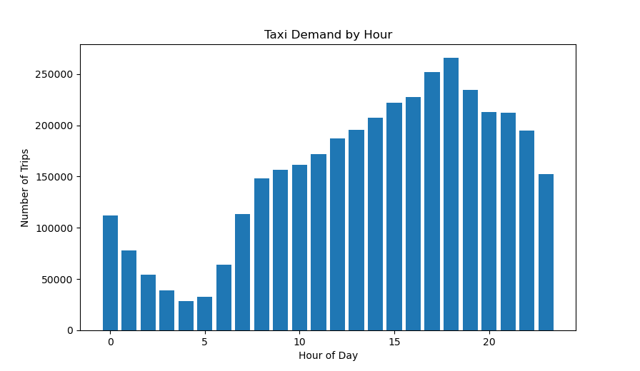
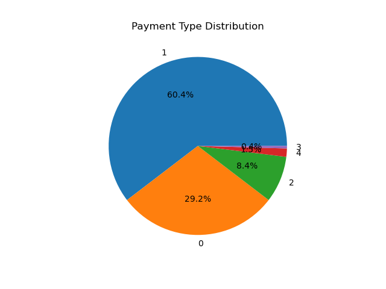
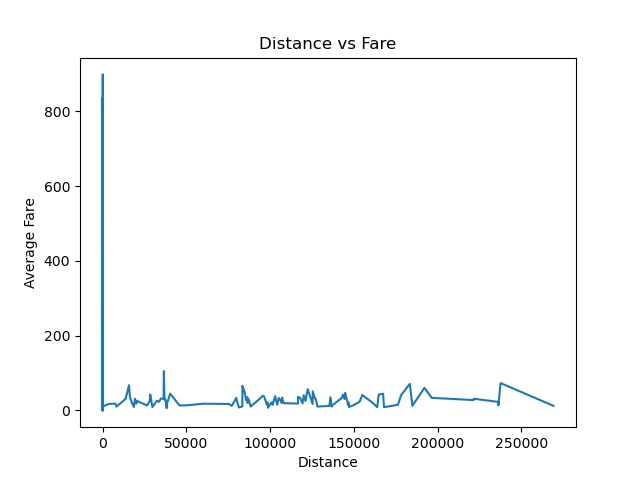
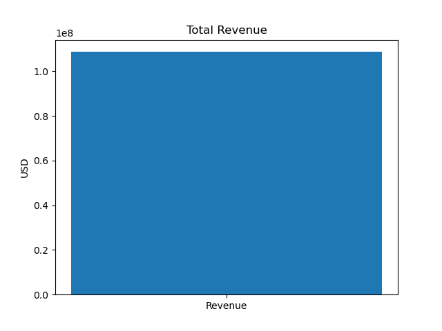

# NYC Taxi Analytics Pipeline 

## Overview

This project analyzes NYC taxi trip data using AWS and Python. Data is stored in Amazon S3, queried using Amazon Athena, and analyzed using Python for visualization.

## Objective

The goal of this project is to understand taxi demand patterns, pricing behavior, and revenue trends using real-world data.

## Technologies Used

* Amazon S3
* Amazon Athena
* SQL
* Python (pandas, matplotlib)
* Parquet data format

## Architecture

S3 → Athena → SQL → CSV → Python Visualization

## Analysis

### 1. Peak Demand by Hour

* Identified busiest hours of the day
* Highest demand observed in evening hours

### 2. Payment Type Distribution

* Majority of payments are made via card
* Cash usage is significantly lower

### 3. Distance vs Fare

* Strong correlation between trip distance and fare amount

### 4. Total Revenue

* Calculated total revenue generated from trips

## Visualizations

### Peak Hours

### Payment Type

### Distance vs Fare

### Total Revenue

## Project Files

* analysis.py → Python analysis script
* CSV files → Athena query outputs
* PNG files → Visualizations

## Key Insights

* Taxi demand peaks during evening hours
* Card payments dominate transactions
* Distance directly affects fare pricing
* Revenue analysis shows business trends

## Why This Project Matters

This project demonstrates how cloud technologies and data analytics can transform raw data into actionable insights.

